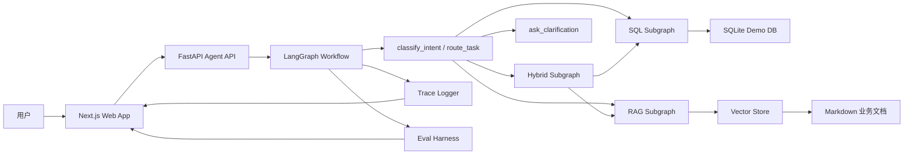

# 系统架构草图

## 目标架构



## 核心流程

```text
START
-> classify_intent
-> route_task
   -> sql_subgraph
      -> retrieve_schema
      -> generate_sql
      -> validate_sql
      -> execute_sql
      -> reflect_sql_error
   -> rag_subgraph
      -> retrieve_docs
      -> generate_doc_answer
   -> hybrid_subgraph
      -> run_sql
      -> run_rag
      -> merge_evidence
   -> ask_clarification
-> final_answer
-> END
```

## 第 1 天边界

第 1 天只完成项目骨架和设计文档，不实现完整 Agent。后续按计划逐步补齐：

- 第 2-3 天：Function Calling 和 ReAct mini agent。
- 第 4-5 天：FastAPI + Next.js 联调。
- 第 6-7 天：LangGraph workflow 和任务路由。
- 第 8-11 天：SQL、RAG、Hybrid 能力。
- 第 12-17 天：恢复、观测、评估和优化。
